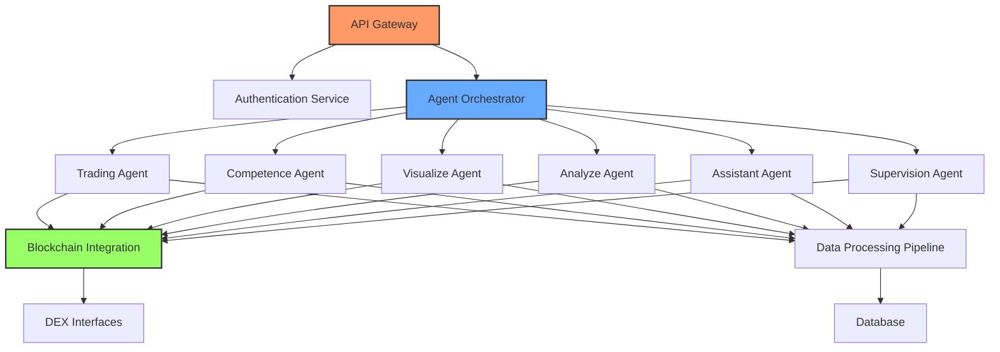

# Web AI DeFi Core

<div align="center">

[](LICENSE)
[](https://python.org)
[](https://github.com/webai-defi/webai-defi-core)
[](https://github.com/webai-defi/webai-defi-core/blob/master/Dockerfile)
[](https://github.com/webai-defi/webai-defi-core)
[](https://github.com/psf/black)

[](https://github.com/webai-defi/webai-defi-core/stargazers)
[](https://github.com/webai-defi/webai-defi-core/network/members)
[](https://github.com/webai-defi/webai-defi-core/issues)
[](https://github.com/webai-defi/webai-defi-core/pulls)

[](https://webaidefi.com)
[](https://webaidefi.com)
[](https://webaidefi.com)
[](https://github.com/webai-defi/webai-defi-core)

</div>

<div align="center">
  
</div>

## ✨ Core AI Agents Backend

Web AI DeFi Core is the backend infrastructure powering our multi-agent AI ecosystem for decentralized finance. This repository contains the production-grade codebase that orchestrates our agent network, providing autonomous trading, analytics, and market intelligence capabilities.

## 🚀 Features

- **Multi-Agent Architecture**: Orchestrated AI agent system with specialized roles
- **Real-Time On-Chain Analytics**: Advanced blockchain data processing pipeline
- **Autonomous Trading**: Self-optimizing execution strategies on DEXs
- **Market Intelligence**: Predictive modeling with quantum-inspired algorithms
- **Visualization Engine**: Data transformation for intuitive market insights
- **Security Services**: Smart contract analysis and risk assessment
- **Distributed Computing**: High-performance computation for real-time trading

## 🧠 Tech Stack

<div align="center">

[](https://python.org)
[](https://fastapi.tiangolo.com/)
[](https://pytorch.org/)
[](https://solana.com/)
[](https://www.docker.com/)
[](https://kubernetes.io/)
[](https://redis.io/)
[](https://www.postgresql.org/)
[](https://docs.pytest.org/)
[](https://python-poetry.org/)

</div>

## 🔧 Installation

### Prerequisites

- Python 3.9+
- Docker & Docker Compose
- Poetry package manager

### Quick Start with Docker

```bash
# Clone the repository
git clone https://github.com/webai-defi/webai-defi-core.git
cd webai-defi-core

# Copy and configure environment variables
cp .env.example .env
# Edit .env with your configuration

# Launch with Docker Compose
docker-compose up -d
```

### Manual Installation

```bash
# Clone the repository
git clone https://github.com/webai-defi/webai-defi-core.git
cd webai-defi-core

# Install dependencies with Poetry
poetry install

# Activate virtual environment
poetry shell

# Run the application
python -m src.main
```

## 🌐 Architecture



## 🧪 Testing

```bash
# Run all tests
poetry run pytest

# Run with coverage report
poetry run pytest --cov=src tests/

# Run E2E tests
poetry run pytest tests/e2e/
```

## 📊 Project Structure

```
webai-defi-core/
├── src/                # Source code
│   ├── agents/         # AI agent implementations
│   ├── api/            # API endpoints
│   ├── blockchain/     # Blockchain integrations
│   ├── core/           # Core functionality
│   ├── db/             # Database models and migrations
│   ├── services/       # Business logic services
│   └── utils/          # Utility functions
├── tests/              # Test suite
│   ├── unit/           # Unit tests
│   ├── integration/    # Integration tests
│   └── e2e/            # End-to-end tests
├── docker-compose.yml  # Docker composition
├── Dockerfile          # Docker configuration
├── pyproject.toml      # Dependencies and project metadata
└── .env.example        # Example environment variables
```

## 🔒 Security

The Web AI DeFi Core platform undergoes regular security audits and implements industry best practices for securing sensitive operations:

- End-to-end encryption for all communications
- Multi-factor authentication for administrative access
- Smart contract verification and formal validation
- Sandboxed execution environments for third-party integrations
- Regular penetration testing and vulnerability scanning

## 📚 Documentation

Comprehensive documentation is available at our [Developer Portal](https://docs.webaidefi.com).

## 🤝 Contributing

We welcome contributions from the community! Please read our [Contributing Guidelines](CONTRIBUTING.md) and [Code of Conduct](CODE_OF_CONDUCT.md) before submitting pull requests.

## 📄 License

This project is licensed under the BSD 3-Clause License - see the [LICENSE](LICENSE) file for details.

## 🌟 Acknowledgements

- The Web AI DeFi Team
- Our amazing community of developers and users
- Open-source projects that made this possible

---

<div align="center">

[](https://twitter.com/WebAIDefi)
[](https://discord.gg/webaidefi)
[](https://t.me/webaidefi)

<p>Built with ❤️ by the Web AI DeFi Team</p>

</div> 
